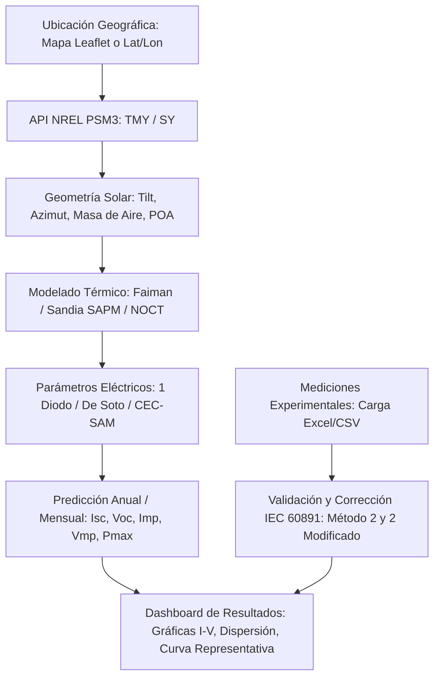

# SUNERGY / SuNLiER: Suite de Simulación Fotovoltaica y Análisis de Curvas I-V

[](https://www.python.org/downloads/)
[](https://dash.plotly.com/)
[](https://pvlib-python.readthedocs.io/)
[](https://opensource.org/licenses/MIT)

**SUNERGY** (también identificado en la interfaz como **SuNLiER** — en alusión al *Instituto de Energías Renovables, IER-UNAM*) es una plataforma técnica e interactiva desarrollada en Python con **Plotly Dash** y **pvlib-python**. Su objetivo es integrar en una única herramienta el modelado meteorológico, la predicción de rendimiento eléctrico y el análisis experimental de curvas corriente-voltaje ($I-V$) bajo estándares normativos internacionales (como **IEC 60891**).

---

## 🚀 Archivo Principal de Ejecución

> ### ⚠️ **PUNTO CLAVE**
> El archivo definitivo y funcional que corre toda la plataforma es:
> ### 👉 `Edi_GIu/GIU_Final_Presetacion.py`
>
> Este archivo consolida la versión final del dashboard interactivo, integrando todas las funciones, bibliotecas, callbacks de visualización y cálculos numéricos requeridos para la presentación final del proyecto.

Para ejecutar la aplicación:

```bash
python Edi_GIu/GIU_Final_Presetacion.py
```
Luego abre tu navegador en `http://127.0.0.1:8050/`.

---

## 📂 Clasificación de Archivos del Proyecto

El repositorio contiene tanto los scripts que conforman el motor de la aplicación actual como archivos históricos derivados del proceso iterativo de desarrollo. A continuación se detalla su relevancia:

### 🟢 Archivos Relevantes (Núcleo Activo de la Aplicación)

Estos archivos son estrictamente necesarios para la ejecución y funcionamiento de `GIU_Final_Presetacion.py`:

| Archivo | Rol / Descripción |
| :--- | :--- |
| **`Edi_GIu/GIU_Final_Presetacion.py`** | **Script principal (Entrypoint).** Orquesta la interfaz en Dash, layout web, navegación por tarjetas, mapas Leaflet y los callbacks reactivos de cálculo y graficación. |
| **`Edi_GIu/Input_File_DIV_Mac_Informe.py`** | **Módulo de componentes UI y procesamiento.** Contiene los generadores de tablas, modales, formularios de parámetros, selectores y las funciones de lectura/limpieza de archivos subidos. |
| **`Edi_GIu/Primer_Funcion_Clima.py`** | **Conexión climática con NREL PSM3.** Descarga y estructura series temporales climáticas (irradiancia, temperatura ambiente, viento) tanto para años típicos (TMY) como años específicos (SY). |
| **`Edi_GIu/Posicion_Solar.py`** | **Geometría solar.** Calcula acimut solar, cenit, masa de aire, ángulo de incidencia e irradiancia efectiva sobre plano del arreglo (*POA*) considerando inclinación (*tilt*) y orientación. |
| **`Edi_GIu/Clima_Car.py`** | **Caracterización meteorológica.** Procesa y formatea las estructuras de datos de radiación y variables climáticas. |
| **`Edi_GIu/Parametros_Electricos.py`** | **Modelado físico de 1 diodo.** Implementa cálculos de temperatura de celda y resuelve los parámetros de circuito equivalente ($I_L, I_0, R_s, R_{sh}, nNsVth$) y operacionales ($I_{sc}, V_{oc}, P_{max}$). |
| **`Edi_GIu/CurvaIV.py`** | **Generador de curvas I-V.** Modela las curvas $I-V$ y $P-V$ utilizando el modelo de 5 parámetros de De Soto y ajuste CEC/SAM. |

---

### 🔴 Archivos Históricos / Obsoletos (No requeridos para la ejecución actual)

Los siguientes archivos corresponden a prototipos previos, pruebas descartadas o proyectos académicos paralelos y **ya no son necesarios** para la ejecución del sistema:

| Archivo / Patrón | Motivo de Obsolescencia |
| :--- | :--- |
| `Edi_GIu/GIU.py`<br>`Edi_GIu/GIU_Final_1.py`<br>`Edi_GIu/GIU_Final_1_2 2-b.py`<br>`Edi_GIu/GIU_Final_1_2_C.py`<br>`Edi_GIu/GIU_Final_1_3.py` | **Versiones anteriores de la GUI.** Fueron etapas intermedias de desarrollo previas a la consolidación de `GIU_Final_Presetacion.py`. |
| `Edi_GIu/Input_File_DIV.py`<br>`Edi_GIu/Input_File_DIV_Mac.py`<br>`Edi_GIu/Input_File_DIV_Mac2.py`<br>`Edi_GIu/Input_File_DIV_Mac2b.py`<br>`Edi_GIu/Input_File_DIV_Mac_C.py` | **Iteraciones previas del módulo de componentes.** Reemplazadas en su totalidad por `Input_File_DIV_Mac_Informe.py`. |
| `Edi_GIu/main.py` | Archivo de arranque preliminar en desuso. |
| `Edi_GIu/123.py` | Script temporal de pruebas rápidas y pruebas unitarias de sintaxis. |
| `Edi_GIu/comprobacion de tablas..py` | Script de verificación puntual de estructuras DataFrame. |
| `Edi_GIu/Temperaturas.py` | Script experimental de modelos térmicos, cuya funcionalidad fue absorbida dentro de `Parametros_Electricos.py` y `Input_File_DIV_Mac_Informe.py`. |
| `Edi_GIu/Funcion_Deep.py`<br>`*.ipynb` (*SVHN*, *FoodHub*, *Uber*, etc.) | Scripts y libretas Jupyter correspondientes a cursos de Deep Learning / Machine Learning independientes al simulador solar. |

---

## ⚡ Capacidades y Flujo Funcional de la Plataforma



### 1. Geolocalización y Recurso Solar
* Mapa interactivo con soporte de localización GPS y medición de distancias/superficies.
* Descarga de datos satelitales vía **NSRDB/PSM3** de NREL (requiere API key configurada en la función de clima).
* Soporte para año típico meteorológico (**TMY**) o años específicos (**SY**) entre 1998 y 2020.

### 2. Especificación del Módulo Fotovoltaico
* **Módulo de prueba preconfigurado** (valores estándar de laboratorio).
* **Entrada manual de parámetros de placa** ($P_{mp}, V_{mp}, I_{mp}, V_{oc}, I_{sc}, \alpha, \beta, \gamma$, celdas en serie, tipo de material).
* **Catálogo CEC (California Energy Commission)** con filtros por marca, modelo y potencia, permitiendo además la **comparación simultánea de 2 módulos**.

### 3. Modelado Térmico de Operación
Estimación de la temperatura de celda ($T_{cell}$) a partir de radiación incidente, velocidad de viento y temperatura ambiente mediante:
* **Faiman** (parámetros ajustables $u_0, u_1$).
* **Sandia SAPM** (según arreglo: *open-rack*, *close-roof*, etc.).
* **NOCT** (*Nominal Operating Cell Temperature*).

### 4. Simulación y Visualización Eléctrica
* Cálculo horario de parámetros de circuito equivalente y potencias de salida.
* Series temporales interactivas y histogramas de distribución estadística.
* Gráficas de dispersión Voltaje vs. Corriente filtradas por mes con `RangeSlider`.

### 5. Análisis y Corrección de Curvas I-V (IEC 60891)
* Trazado de curvas $I-V$ y $P-V$ teóricas con localización del punto de máxima potencia (MPP).
* Componente para arrastrar y soltar (`dcc.Upload`) datos reales medidos con trazador de curvas.
* Corrección de curvas medidas a condiciones estándar o deseadas mediante **Procedimiento 2 (Método 2)** y **Método 2 normalizado**.
* Cálculo estadístico de **Curva Representativa** sobre conjuntos de mediciones.
* Tablas comparativas cuantitativas de desempeño: **Medición real vs. Simulación**.

---

## 🛠️ Requisitos e Instalación

### Prerrequisitos
* Python 3.9 o superior
* Acceso a internet para consultas de la API satelital de NREL

### Instalación de dependencias

Clona el repositorio y crea un entorno virtual:

```bash
git clone git@github.com:Edgar-daniel-ignacio/SUNERGY.git
cd SUNERGY

# Crear y activar entorno virtual
python3 -m venv venv
source venv/bin/activate  # En Windows: venv\Scripts\activate
```

Instala las bibliotecas requeridas:

```bash
pip install dash dash-bootstrap-components dash-leaflet pvlib plotly cufflinks pandas numpy scipy openpyxl
```

---

## 💻 Uso de la Aplicación

1. Inicia el servidor de desarrollo:
   ```bash
   python Edi_GIu/GIU_Final_Presetacion.py
   ```
2. Accede en tu navegador a `http://127.0.0.1:8050/`.
3. Selecciona las coordenadas del proyecto en el mapa o introduce latitud/longitud.
4. Elige el tipo de datos del módulo (Prueba, Manual o Catálogo CEC).
5. Selecciona el modelo térmico y el periodo temporal (TMY o año específico).
6. Explora las curvas de predicción energética y utiliza el módulo de **Curvas I-V** para cargar mediciones y aplicar correcciones normativas.

---

## 👥 Créditos y Contexto

Proyecto desarrollado en el marco de investigación y desarrollo fotovoltaico (**SUNERGY** / **SuNLiER**), enfocado en el análisis, modelado riguroso y caracterización de sistemas solares fotovoltaicos.
